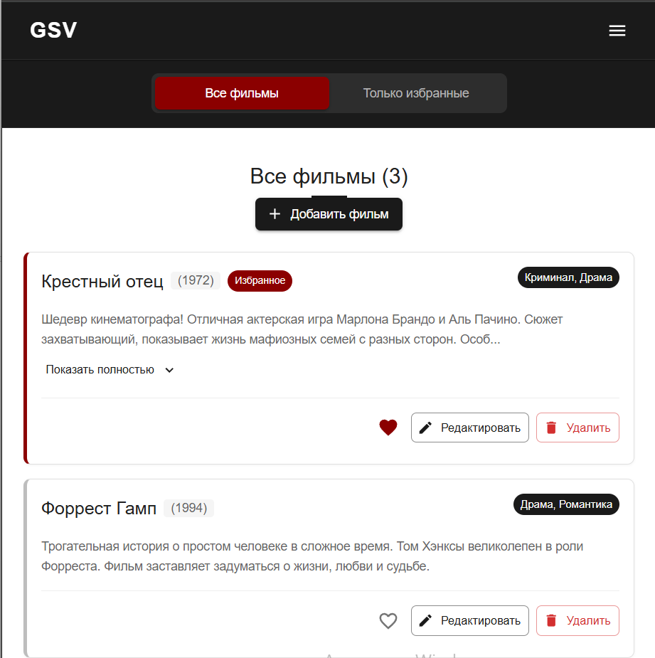
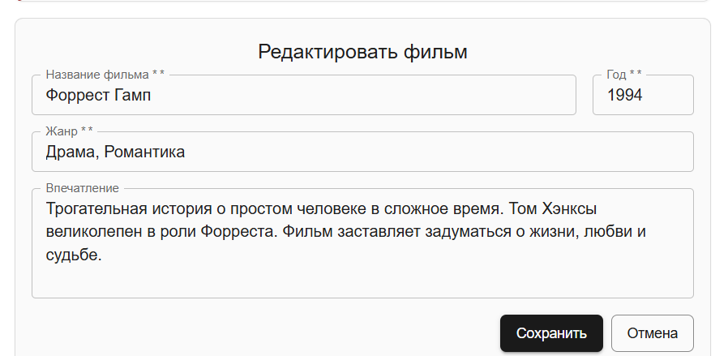
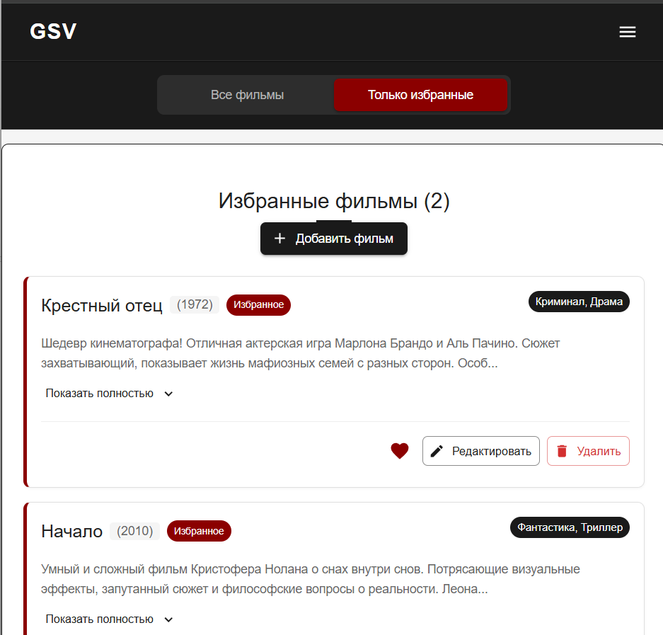

# Список фильмов

React-приложение для отображения списка фильмов и управления избранными.

## Функционал
- Отображение списка фильмов с информацией (название, год, жанр, рейтинг)
- Добавление/удаление фильмов из списка
- Добавление/удаление фильмов из избранного
- Отдельный раздел для избранных фильмов
- Счетчики количества всех и избранных фильмов

## Скриншоты

Скриншот 1. Главная страница приложения с отображением всех фильмов

Скриншот 2. Модальное окно для добавления нового фильма

Скриншот 3. Форма редактирования информации о фильме

Скриншот 4. Фильтрация для просмотра только избранных фильмов